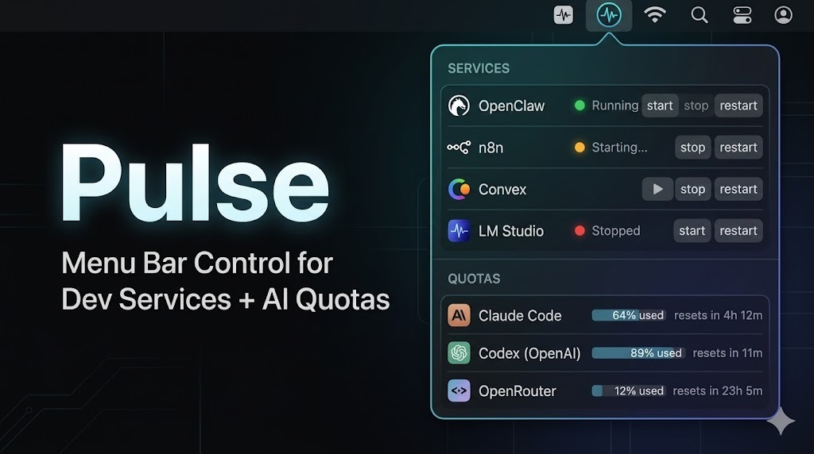

# Pulse

A lightweight macOS menu bar app for managing local dev services and tracking AI coding tool quotas.




## What it does

Pulse sits in your menu bar and gives you two things at a glance:

**Services** — Start, stop, and restart local dev processes (API servers, build tools, background workers). Pulse monitors them by port or PID and shows live status.

**Quotas** — See how much of your AI coding tool quota you've used. Supports Claude Code (session + weekly limits), Codex/OpenAI, and OpenRouter. Shows usage bars, percentages, and reset countdowns.

## Install

```bash
git clone https://github.com/silas-maven/pulse.git
cd pulse
./install.sh
```

The install script will:
1. Build Pulse from source (release mode)
2. Install the binary to `/usr/local/bin/pulse`
3. Walk you through provider setup (Claude Code, Codex, OpenRouter)
4. Let you add services to manage
5. Optionally create a LaunchAgent for auto-start on login

Requires **macOS 14+** and **Swift 6** (Xcode or Command Line Tools).

### Manual build

If you prefer to skip the installer:

```bash
swift build -c release
.build/release/Pulse
```

Pulse will create `~/.pulse/` with empty defaults on first launch.

## Configuration

Pulse reads config from `~/.pulse/`. The install script writes these files, or you can edit them directly.

### Services (`~/.pulse/services.json`)

Define the processes you want Pulse to manage:

```json
[
  {
    "name": "API Server",
    "command": "cd ~/projects/myapp && npm start",
    "port": 3000,
    "logFile": "/tmp/api-server.log",
    "autostart": true
  },
  {
    "name": "Background Worker",
    "command": "node ~/projects/myapp/worker.js",
    "pidFile": "/tmp/worker.pid",
    "logFile": "/tmp/worker.log",
    "autostart": false
  },
  {
    "name": "Dev UI",
    "command": "cd ~/projects/myapp/ui && npx vite",
    "port": 5173,
    "portlessName": "myapp",
    "autostart": true
  }
]
```

| Field | Type | Description |
|-------|------|-------------|
| `name` | string | Display name in the menu bar |
| `command` | string | Shell command to start the process |
| `port` | number? | TCP port to check for liveness |
| `pidFile` | string? | Path to a PID file (alternative to port check) |
| `logFile` | string? | Where to write stdout/stderr |
| `autostart` | bool | Start automatically on "Restart All" |
| `portlessName` | string? | If set, wraps the command with `portless <name> <command>` |

### Providers (`~/.pulse/providers.json`)

Configure which AI quota providers to track:

```json
[
  {
    "provider": "claude-code",
    "displayName": "Claude Code",
    "source": "cli",
    "enabled": true
  },
  {
    "provider": "codex",
    "displayName": "Codex (OpenAI)",
    "source": "auto",
    "enabled": true
  },
  {
    "provider": "openrouter",
    "displayName": "OpenRouter",
    "source": "api",
    "apiKey": "sk-or-...",
    "enabled": true
  }
]
```

## Supported quota providers

| Provider | How it works |
|----------|-------------|
| **Claude Code** | Reads OAuth token from macOS Keychain, hits the Anthropic usage API. Shows session (5h) and weekly (7d) utilization with reset timers. |
| **Codex (OpenAI)** | Runs `openclaw status --json` to get context window usage and model info. |
| **OpenRouter** | Calls `/api/v1/auth/key` with your API key. Shows credits used vs limit. |

### Adding after install

```bash
scripts/add-service.sh    # interactive: add a service
scripts/add-provider.sh   # interactive: add a quota provider
```

Or edit `~/.pulse/services.json` and `~/.pulse/providers.json` directly, then hit **Reload Config** in the menu bar.

### Adding a new fetcher

Create a fetcher in `Sources/Quotas/Fetchers/`, return a `QuotaStatus`, and add the case to `QuotaManager.fetchQuota(for:)`.

## Architecture

```
Sources/
├── App/
│   ├── PulseApp.swift          # Entry point, menu bar setup
│   └── MenuBarView.swift       # Tab switcher (Services | Quotas)
├── Services/
│   ├── ServiceManager.swift    # Process lifecycle, port/PID monitoring
│   └── ServiceRowView.swift    # Per-service UI row
├── Quotas/
│   ├── QuotaManager.swift      # Parallel fetching, poll timer
│   ├── QuotaState.swift        # Data models (QuotaTier, QuotaData)
│   ├── QuotaConfig.swift       # providers.json loader
│   ├── QuotaRowView.swift      # Per-provider UI with usage bars
│   ├── QuotaDefinition.swift   # Provider config model
│   └── Fetchers/
│       ├── ClaudeCodeFetcher.swift
│       ├── CodexFetcher.swift
│       └── OpenRouterFetcher.swift
└── Shared/
    ├── Config.swift             # ~/.pulse/ bootstrap + services.json loader
    ├── ProcessUtil.swift        # Port checks, PID management, process spawning
    └── ServiceDefinition.swift  # Service config model
```

- Pure SwiftUI with `@Observable` (no Combine, no ObservableObject)
- No external dependencies — just Foundation and SwiftUI
- Services polled every 5s, quotas every 5 minutes
- Runs as a menu bar-only app (no Dock icon)

## Memory usage

Pulse typically uses 15-25 MB of RAM. No web views, no Electron, no embedded browser.

## License

MIT
